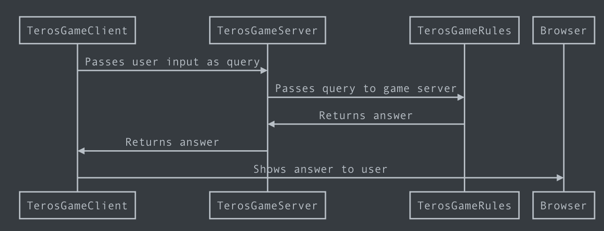

# Why
- I want to see if a web interpreter of the rules is possible.
- I want to build an interface that can model attacks.
- Users will no longer have to handwrite a file if I get this right.

# What is it
- TerosGameRules: On the server. Read queries and applies game logic to figure out results. 
- TerosGameServer: On the server. Listens to requests from clients and passes them along to the TerosGameRules.
- TerosGameClient: On the user's machine. Responsible for making queries and showing results from the TerosGameServer to the user.

```TerosGameClient->TerosGameServer: Passes user input as query

TerosGameServer->TerosGameRules: Passes query to game server

TerosGameRules->TerosGameServer: Returns answer

TerosGameServer->TerosGameClient: Returns answer

TerosGameClient->Browser: Shows answer to user
```



This project holds the game rules. Need to make the server and client.

Need to agree on a data transfer protocol. It can be raw JSON.

# What can we do afterward
- Publish it!
- Game Server and Client need to update their protocol.
- Game Client can finally work on presentation.
- How much information will we send? Will this be stateless?